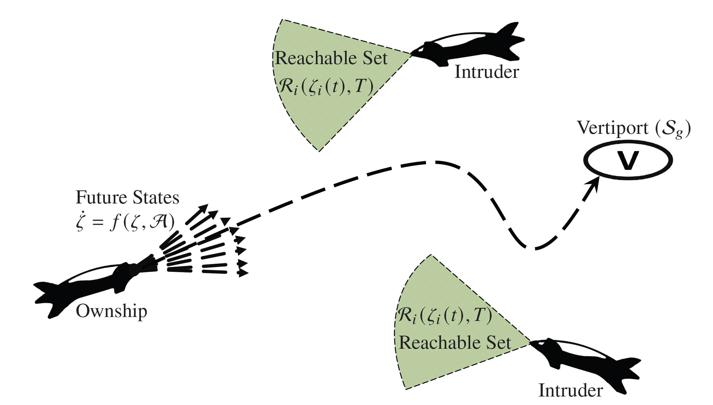

Safe and Scalable Real-time Trajectory Planner for Urban Air Mobility
===================================

   
Overview
--------

The goal of this project is to develop a real-time planning framework that's both safe and scalable. The following are the key features of the developed trajectory planner.

#. **Decentralized Free-Flight Concept**:
   
   - Every aircraft independently handles conflict resolution and ensures safety by considering the predicted positions of nearby planes.
   
#. **Two-Part Framework**:
   
   - **Reachability Analysis Tool**: Predicts potential aircraft movements using data from simulated trajectories.
   - **Decision Maker**: Uses a 6-degree freedom model for fixed-wing aircraft to plan collision-free paths.

#. **Safety Enhancements**:
   
   - Incorporates techniques like reward shaping and action shielding to boost safety.
   
#. **Performance Testing**:
   
   - Simulated tests with up to 32 aircraft showed the effectiveness of this framework, measured by reduced Near Mid Air Collisions (NMAC) and computational efficiency.

    

Contents
--------
    
Check out the following sections for further infromation about the project, including the implemented :doc:`scenario`, :doc:`results` from the experiments, and :doc:`usage` for :ref:`installation` of the project.

.. toctree::
   :maxdepth: 2
   
   index
   scenario
   results
   usage

For the full implementation of this project, please visit our `GitHub repository <https://github.com/Abenezergirma/Chapter-1>`_.

.. note::

   This project is under active development.
   
   

