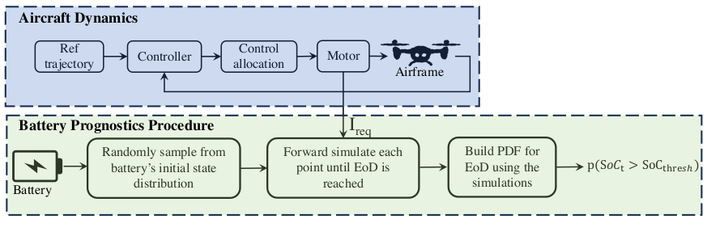

Investigating Wind Impact on UAS-Operations from a Battery Energy Perspective
===================================

   
Overview
--------

The overall objective of this project is to develop a framework to quantify uncertainty in mission success due to available battery energy considering different wind conditions.
This repository is structured into three major tasks which can be summarized as follows: 

#.  **Electro-chemical based Battery Model**
   
   
#. **Detailed Dynamic Model for Octo-rotor**
   

#. **Model-Based Battery Prognostics Architecture**
   
The battery model utilized in this study is an electro-chemical-based model of Lithium-ion batteries, as described in [1], which are a popular choice for powering unmanned aerial vehicles. 
    

Contents
--------
    
Check out the following sections for further infromation about the project, including the implemented :doc:`scenario`, :doc:`results` from the experiments, and :doc:`usage` for :ref:`installation` of the project.

.. toctree::
   :maxdepth: 2
   
   index
   results
   usage

For the full implementation of this project, please visit our `GitHub repository <https://github.com/Abenezergirma/Investigating-Wind-Impact-on-UAS-Operations-from-a-Battery-Energy-Perspective>`_.

.. note::

   This project is under active development.
   
   
[1] https://papers.phmsociety.org/index.php/phmconf/article/view/2252
