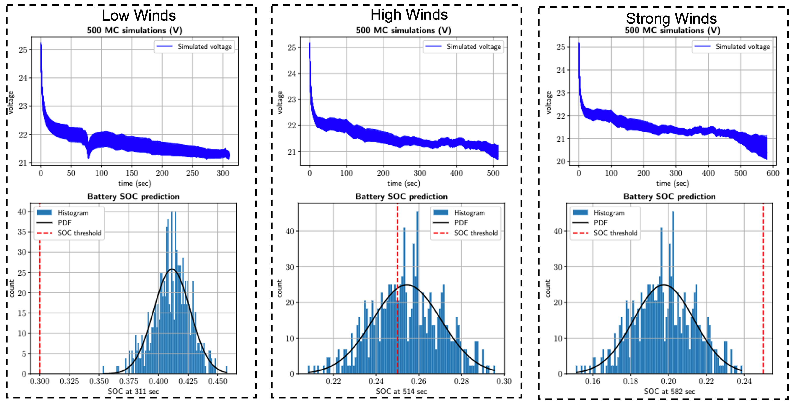

Results
=========

We conducted four sets of experiments, each with varying wind forecasts, to observe differences in the effect of wind on battery energy consumption. The results of these experiments, including the specific wind conditions and their corresponding impact on mission success, are presented in the following Table. To determine the probability of mission success or failure, we established a threshold SoC value of :math:`25\%` at the end of the flight. If the SoC value for a given flight plan falls below :math:`25\%`, we consider the mission a failure, while if it is above this value, we consider it safe. 

.. list-table:: Wind Conditions and Their Impact on Probability of Mission Success in Battery-Related Experiments
   :widths: auto
   :header-rows: 1
   :align: center

   * - **Scenario**
     - **Mean Wind Speed (m/s)**
     - **Mean Direction (deg)**
     - **Probability of Mission Success**
     - **Flight Time (Seconds)**
   * - No Wind
     - 0
     - 0
     - 1
     - 311
   * - Forecast 1
     - 7.2
     - 185
     - 1
     - 311
   * - Forecast 2
     - 10.43
     - 192
     - 0.57
     - 514
   * - Forecast 3
     - 13.71
     - 190
     - 0
     - 582

Voltage and SoC Predictions
---------------------------
The following figure presents the output voltage and SoC predictions, resulting from 500 Monte Carlo simulations. The first experiment is represented in the left most figures, where the aircraft operates in the presence of low wind speeds. All the SoC predictions of the battery exceed the threshold value of :math:`25\%`, indicating a probability of mission success of 1. For the second case study, we simulated the aircraft operating at high wind speeds and present the voltage and SoC predictions in middle figures. In this case, a portion of the Monte Carlo simulations resulted in an SoC value below the threshold, while others were above it. Therefore, we can compute the probability of mission success and get a probability of :math:`0.57`. Finally, we conducted the experiment in the presence of strong wind, and the outcomes are shown in the right figures. It is apparent that all SoC predictions are below the threshold value. Thus, the probability of mission success in this scenario is 0. Based on the results, it can be inferred that an increase in wind speed leads to a rise in aircraft battery energy consumption, consequently resulting in a decrease in mission success probability.

