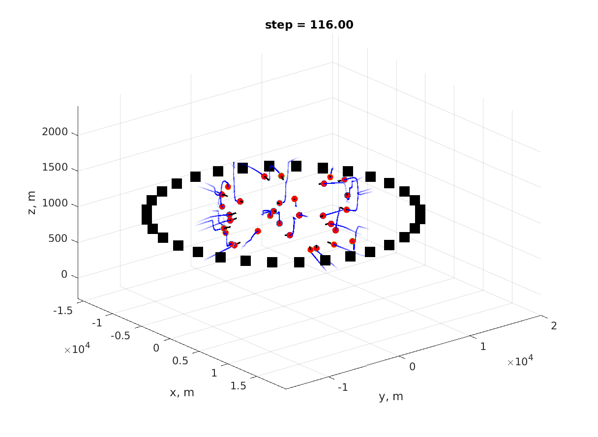
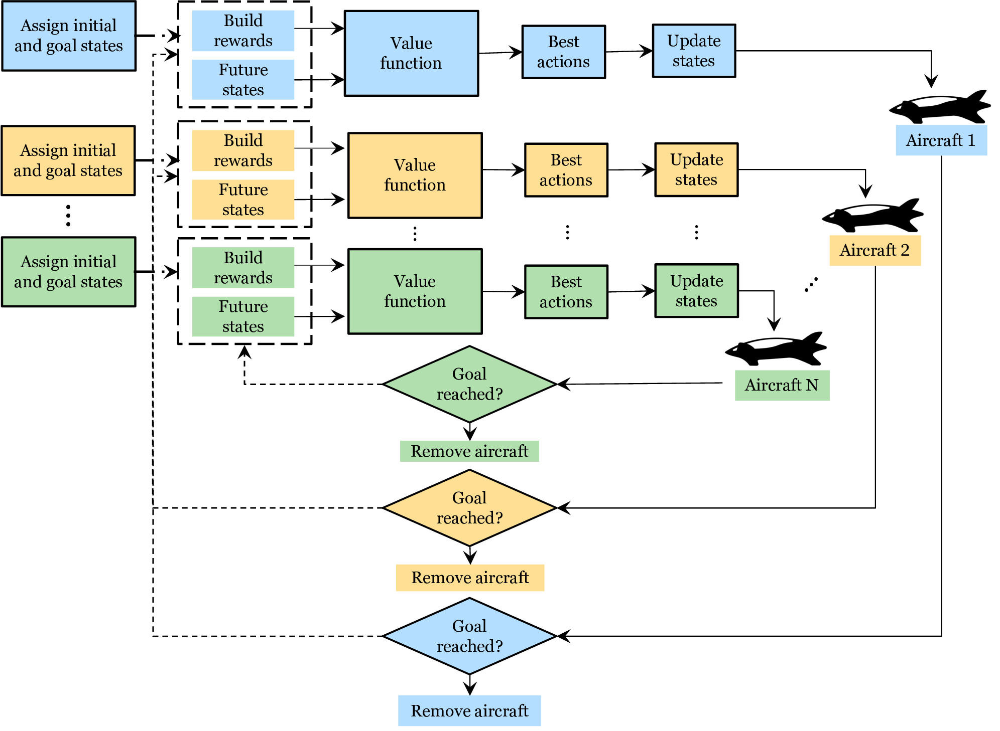

Trajectory Planning Scenario   
=========
The performance of the  trajectory planning framework is shown in the following figure. The simulation defined a geographical bounding box that encompasses a volume of (:math:`15km`) radius. The aircraft are assigned to take off from their origin vertiports and fly to destination vertiports located on the opposite side of their origin. The environment is configurable to accommodate a variable number of vertiports and aircraft, which utilize the proposed trajectory planning framework in a distributed manner. 

In the above figure, the environment simulates the operation of 32 aircraft, each rendered as a red circle. The black boxes represent the vertiports where the aircraft take off and navigate towards. The black lines represent the aircraft trajectories for the next ten steps. The blue lines indicate the paths traveled by aircraft.

Working Principle
-----------------
The following Schematic diagram explains the working principle of the trajectory planner. The framework assigns initial and goal states for each aircraft and identifies reward sources. It, then, projects future states and computes their values with the value function. Finally, the best action yielding the maximum reward will be selected and the aircraft states will be updated accordingly. This process is repeated iteratively until each aircraft reaches its destination vertiport.

